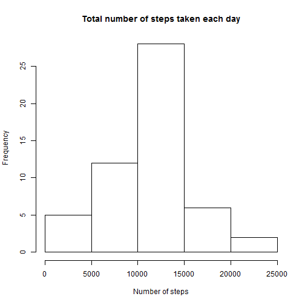
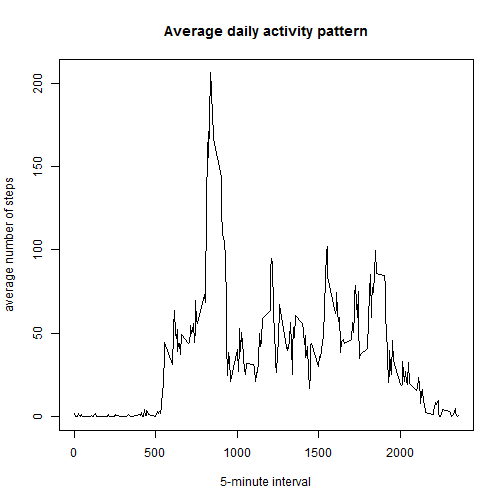
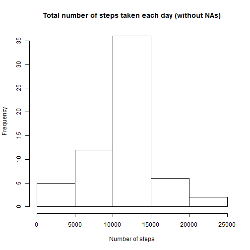

Peer Assessment 1. Reproducible Research
=============================


## Introduction
It is now possible to collect a large amount of data about personal movement using activity monitoring devices such as a [Fitbit](http://www.fitbit.com/), [Nike Fuelband](http://www.nike.com/us/en_us/c/nikeplus-fuelband), or [Jawbone Up](https://jawbone.com/up). These type of devices are part of the "quantified self" movement - a group of enthusiasts who take measurements about themselves regularly to improve their health, to find patterns in their behavior, or because they are tech geeks. But these data remain under-utilized both because the raw data are hard to obtain and there is a lack of statistical methods and software for processing and interpreting the data.

This assignment makes use of data from a personal activity monitoring device. This device collects data at 5 minute intervals through out the day. The data consists of two months of data from an anonymous individual collected during the months of October and November, 2012 and include the number of steps taken in 5 minute intervals each day.

## Data

The data for this assignment can be downloaded from the course web site:

Dataset: [Activity monitoring data][1] [52K]
The variables included in this dataset are:

- **steps**: Number of steps taking in a 5-minute interval (missing values are coded as NA)

- **date**: The date on which the measurement was taken in YYYY-MM-DD format

- **interval**: Identifier for the 5-minute interval in which measurement was taken

The dataset is stored in a comma-separated-value (CSV) file and there are a total of 17,568 observations in this dataset.

## My report

Setting global options

```r
options(scipen = 1, digits = 2) # Numbers in fixed notation with two decimals
Sys.setlocale("LC_TIME", "English") # Change the local settings to English
```

```
## [1] "English_United States.1252"
```
### Loading and preprocessing the data
  
Load data.

```r
data = read.csv("activity.csv") 
```
    
Some descriptive values.

```r
head(data)
```

```
##   steps       date interval
## 1    NA 2012-10-01        0
## 2    NA 2012-10-01        5
## 3    NA 2012-10-01       10
## 4    NA 2012-10-01       15
## 5    NA 2012-10-01       20
## 6    NA 2012-10-01       25
```

```r
summary(data)
```

```
##      steps              date          interval   
##  Min.   :  0    2012-10-01:  288   Min.   :   0  
##  1st Qu.:  0    2012-10-02:  288   1st Qu.: 589  
##  Median :  0    2012-10-03:  288   Median :1178  
##  Mean   : 37    2012-10-04:  288   Mean   :1178  
##  3rd Qu.: 12    2012-10-05:  288   3rd Qu.:1766  
##  Max.   :806    2012-10-06:  288   Max.   :2355  
##  NA's   :2304   (Other)   :15840
```

```r
str(data)
```

```
## 'data.frame':	17568 obs. of  3 variables:
##  $ steps   : int  NA NA NA NA NA NA NA NA NA NA ...
##  $ date    : Factor w/ 61 levels "2012-10-01","2012-10-02",..: 1 1 1 1 1 1 1 1 1 1 ...
##  $ interval: int  0 5 10 15 20 25 30 35 40 45 ...
```
The data is tidy, it contains some missing values (NA's), and it has information from 61 levels(days).

Since the date column is a factor, I will change it to as.Date to facilitate later analysis.

```r
data$date <- as.Date(data$date)
str(data)
```

```
## 'data.frame':	17568 obs. of  3 variables:
##  $ steps   : int  NA NA NA NA NA NA NA NA NA NA ...
##  $ date    : Date, format: "2012-10-01" "2012-10-01" ...
##  $ interval: int  0 5 10 15 20 25 30 35 40 45 ...
```


### What is the mean total number of steps taken per day?

Before I start answering this point, I need to add the steps by day. 

```r
steps_date <- aggregate(steps ~ date, data = data, sum)
head(steps_date)
```

```
##         date steps
## 1 2012-10-02   126
## 2 2012-10-03 11352
## 3 2012-10-04 12116
## 4 2012-10-05 13294
## 5 2012-10-06 15420
## 6 2012-10-07 11015
```

```r
summary(steps_date)
```

```
##       date                steps      
##  Min.   :2012-10-02   Min.   :   41  
##  1st Qu.:2012-10-16   1st Qu.: 8841  
##  Median :2012-10-29   Median :10765  
##  Mean   :2012-10-30   Mean   :10766  
##  3rd Qu.:2012-11-16   3rd Qu.:13294  
##  Max.   :2012-11-29   Max.   :21194
```

```r
str(steps_date)
```

```
## 'data.frame':	53 obs. of  2 variables:
##  $ date : Date, format: "2012-10-02" "2012-10-03" ...
##  $ steps: int  126 11352 12116 13294 15420 11015 12811 9900 10304 17382 ...
```
As shown in the str output, there are only 53 obs. with values, this mean that 8 (61-53) days only have NA values.


* Make a histogram of the total number of steps taken each day

```r
hist(steps_date$steps, main = "Total number of steps taken each day", 
     xlab = "Number of steps")
```

 


* Calculate and report the mean and median total number of steps taken per day

```r
mean_steps <- mean(steps_date$steps)
median_steps <- median(steps_date$steps)
```

The mean is **10766.19** and the median is **10765**.
    
### What is the average daily activity pattern?

* Make a time series plot (i.e. type = "l") of the 5-minute interval (x-axis) and the average number of steps taken, averaged across all days (y-axis)

Before I start answering this point, I need to add the steps by interval across days. 

```r
steps_interval <- aggregate(steps ~ interval, data = data, mean)
head(steps_interval)
```

```
##   interval steps
## 1        0 1.717
## 2        5 0.340
## 3       10 0.132
## 4       15 0.151
## 5       20 0.075
## 6       25 2.094
```

```r
summary(steps_interval)
```

```
##     interval        steps    
##  Min.   :   0   Min.   :  0  
##  1st Qu.: 589   1st Qu.:  2  
##  Median :1178   Median : 34  
##  Mean   :1178   Mean   : 37  
##  3rd Qu.:1766   3rd Qu.: 53  
##  Max.   :2355   Max.   :206
```

```r
str(steps_interval)
```

```
## 'data.frame':	288 obs. of  2 variables:
##  $ interval: int  0 5 10 15 20 25 30 35 40 45 ...
##  $ steps   : num  1.717 0.3396 0.1321 0.1509 0.0755 ...
```

The series plot.

```r
plot(steps_interval$interval, steps_interval$steps, main = "Average daily activity pattern", 
     xlab = "5-minute interval", ylab = "average number of steps", type = "l")
```

 


* Which 5-minute interval, on average across all the days in the dataset, contains the maximum number of steps?


```r
max_steps <- max(steps_interval$steps)
max_index <- which(steps_interval$steps == max_steps)
max_interval <- steps_interval$interval[max_index]
```

The interval containing the maximum number of steps in average is **835**.


## Input missing values

* Calculate and report the total number of missing values in the dataset (i.e. the total number of rows with NAs)


```r
na <- sum(is.na(data$steps))
```

The total number of rows with NAs is **2304** and it is equivalent to the 8 days where data were missing (2304 NAs/288 obs.per.day = 8 days).

* Devise a strategy for filling in all of the missing values in the dataset. The strategy does not need to be sophisticated. For example, you could use the mean/median for that day, or the mean for that 5-minute interval, etc.

I decided to fill the missing data with the mean for the 5-minute intervals that are missing. 

* Create a new dataset that is equal to the original dataset but with the missing data filled in.


```r
interval_61 <- rep(steps_interval$steps, times = 61) # Create a vector  that repeats 61 times (for the 61 days) the values with the mean for the 5-minute intervals
data[,4] <- cbind(interval_61)
data_noNAs <- data
data_noNAs$steps <- ifelse(is.na(data_noNAs$steps), data_noNAs[,4], data_noNAs$steps) # Replace the NAs with the mean for the 5-minute intervals 
data_noNAs <- data_noNAs[,1:3] # new database without NAs
```

This is the new data set without NAs.

```r
head(data_noNAs)
```

```
##   steps       date interval
## 1 1.717 2012-10-01        0
## 2 0.340 2012-10-01        5
## 3 0.132 2012-10-01       10
## 4 0.151 2012-10-01       15
## 5 0.075 2012-10-01       20
## 6 2.094 2012-10-01       25
```

```r
summary(data_noNAs)
```

```
##      steps          date               interval   
##  Min.   :  0   Min.   :2012-10-01   Min.   :   0  
##  1st Qu.:  0   1st Qu.:2012-10-16   1st Qu.: 589  
##  Median :  0   Median :2012-10-31   Median :1178  
##  Mean   : 37   Mean   :2012-10-31   Mean   :1178  
##  3rd Qu.: 27   3rd Qu.:2012-11-15   3rd Qu.:1766  
##  Max.   :806   Max.   :2012-11-30   Max.   :2355
```

```r
str(data_noNAs)
```

```
## 'data.frame':	17568 obs. of  3 variables:
##  $ steps   : num  1.717 0.3396 0.1321 0.1509 0.0755 ...
##  $ date    : Date, format: "2012-10-01" "2012-10-01" ...
##  $ interval: int  0 5 10 15 20 25 30 35 40 45 ...
```

* Make a histogram of the total number of steps taken each day and Calculate and report the mean and median total number of steps taken per day. Do these values differ from the estimates from the first part of the assignment? What is the impact of imputing missing data on the estimates of the total daily number of steps?

Before I start answering this point, I need to add the steps across days.

```r
steps_date_noNAs <- aggregate(steps ~ date, data = data_noNAs, sum)
head(steps_date_noNAs)
```

```
##         date steps
## 1 2012-10-01 10766
## 2 2012-10-02   126
## 3 2012-10-03 11352
## 4 2012-10-04 12116
## 5 2012-10-05 13294
## 6 2012-10-06 15420
```

```r
summary(steps_date_noNAs)
```

```
##       date                steps      
##  Min.   :2012-10-01   Min.   :   41  
##  1st Qu.:2012-10-16   1st Qu.: 9819  
##  Median :2012-10-31   Median :10766  
##  Mean   :2012-10-31   Mean   :10766  
##  3rd Qu.:2012-11-15   3rd Qu.:12811  
##  Max.   :2012-11-30   Max.   :21194
```

```r
str(steps_date_noNAs)
```

```
## 'data.frame':	61 obs. of  2 variables:
##  $ date : Date, format: "2012-10-01" "2012-10-02" ...
##  $ steps: num  10766 126 11352 12116 13294 ...
```


Histogram of the total number of steps taken each day without NAs.


```r
hist(steps_date_noNAs$steps, main = "Total number of steps taken each day (without NAs)", 
     xlab = "Number of steps")
```

 

Calculating the mean and median without NAs.


```r
mean_steps_noNAs <- mean(steps_date_noNAs$steps)
median_steps_noNAs <- median(steps_date_noNAs$steps)
```

The mean without NAs is **10766.19** and the median is **10766.19**.

* Do these values (mean and median) differ from the estimates from the first part of the assignment? 

**10766.19 vs. 10766.19** (mean vs. mean without NAs) and **10765 vs. 10766.19** (median vs. median without NAs). 

* What is the impact of imputing missing data on the estimates of the total daily number of steps?

The impact of replacing the NAs with the mean for the corresponding 5-minute interval was negligible. Since entire days were missing, by adding the mean for the corresponding 5-minute intervals, the estimates would then be more biased towards the mean. This makes the mean and median without NAs to be more similar to each other than in the case with NAs.


### Are there differences in activity patterns between weekdays and weekends?

* Create a new factor variable in the dataset with two levels - "weekday" and "weekend" indicating whether a given date is a weekday or weekend day.


```r
data_noNAs[,4] <- weekdays(data_noNAs$date) # Determine whether the date corresponds to weekend or weekday
data_noNAs[,5] <- "weekday"
weekend <- which(data_noNAs[,4] %in% c("Sunday", "Saturday")) # Determine which rows are weekend
data_noNAs[weekend,5] <- "weekend"
data_noNAs <- data_noNAs[,c(1:3, 5)]
colnames(data_noNAs)[4] <- "day" 
data_noNAs$day <- as.factor(data_noNAs$day) # Final database with weekend and weekdays as factor
head(data_noNAs)
```

```
##   steps       date interval     day
## 1 1.717 2012-10-01        0 weekday
## 2 0.340 2012-10-01        5 weekday
## 3 0.132 2012-10-01       10 weekday
## 4 0.151 2012-10-01       15 weekday
## 5 0.075 2012-10-01       20 weekday
## 6 2.094 2012-10-01       25 weekday
```

```r
summary(data_noNAs)
```

```
##      steps          date               interval         day       
##  Min.   :  0   Min.   :2012-10-01   Min.   :   0   weekday:12960  
##  1st Qu.:  0   1st Qu.:2012-10-16   1st Qu.: 589   weekend: 4608  
##  Median :  0   Median :2012-10-31   Median :1178                  
##  Mean   : 37   Mean   :2012-10-31   Mean   :1178                  
##  3rd Qu.: 27   3rd Qu.:2012-11-15   3rd Qu.:1766                  
##  Max.   :806   Max.   :2012-11-30   Max.   :2355
```

```r
str(data_noNAs)
```

```
## 'data.frame':	17568 obs. of  4 variables:
##  $ steps   : num  1.717 0.3396 0.1321 0.1509 0.0755 ...
##  $ date    : Date, format: "2012-10-01" "2012-10-01" ...
##  $ interval: int  0 5 10 15 20 25 30 35 40 45 ...
##  $ day     : Factor w/ 2 levels "weekday","weekend": 1 1 1 1 1 1 1 1 1 1 ...
```

* Make a panel plot containing a time series plot (i.e. type = "l") of the 5-minute interval (x-axis) and the average number of steps taken, averaged across all weekday days or weekend days (y-axis).

Before I start answering this point, I need to add the steps by interval across days, dividing the data in weekend and wekkdays.

```r
steps_interval_weekend <- aggregate(steps ~ interval, data = data_noNAs[data_noNAs$day == "weekend",], mean) # Steps vs. interval only for weekend
steps_interval_weekend[,3] <- "weekend"

steps_interval_weekday <- aggregate(steps ~ interval, data = data_noNAs[data_noNAs$day != "weekend",], mean) # Steps vs. interval only for weekdays
steps_interval_weekday[,3] <- "weekday"

data_week <- rbind(steps_interval_weekday, steps_interval_weekend)
colnames(data_week)[3] <- "day"
data_week$day <- as.factor(data_week$day) # Final database with weekend and weekdays as factor
head(data_week)
```

```
##   interval steps     day
## 1        0 2.251 weekday
## 2        5 0.445 weekday
## 3       10 0.173 weekday
## 4       15 0.198 weekday
## 5       20 0.099 weekday
## 6       25 1.590 weekday
```

```r
summary(data_week)
```

```
##     interval        steps          day     
##  Min.   :   0   Min.   :  0   weekday:288  
##  1st Qu.: 589   1st Qu.:  2   weekend:288  
##  Median :1178   Median : 28                
##  Mean   :1178   Mean   : 39                
##  3rd Qu.:1766   3rd Qu.: 61                
##  Max.   :2355   Max.   :230
```

```r
str(data_week)
```

```
## 'data.frame':	576 obs. of  3 variables:
##  $ interval: int  0 5 10 15 20 25 30 35 40 45 ...
##  $ steps   : num  2.251 0.445 0.173 0.198 0.099 ...
##  $ day     : Factor w/ 2 levels "weekday","weekend": 1 1 1 1 1 1 1 1 1 1 ...
```

Lattice plot

```r
library(lattice)
xyplot(steps ~ interval | day , data = data_week, ylab="Number of steps", xlab="Interval", layout = c(1,2), type = "l")
```

 

